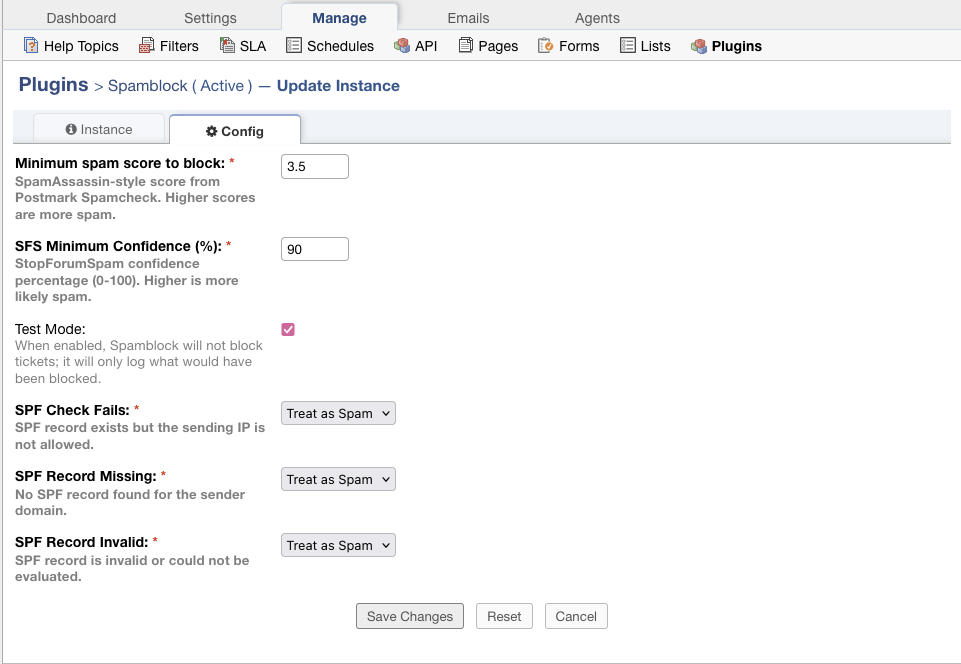
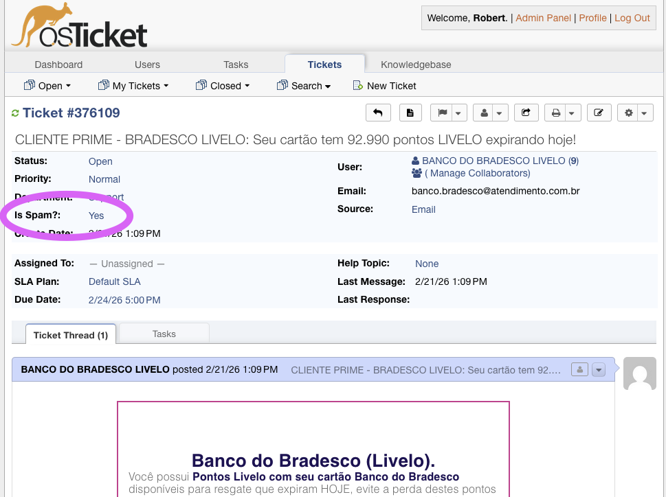
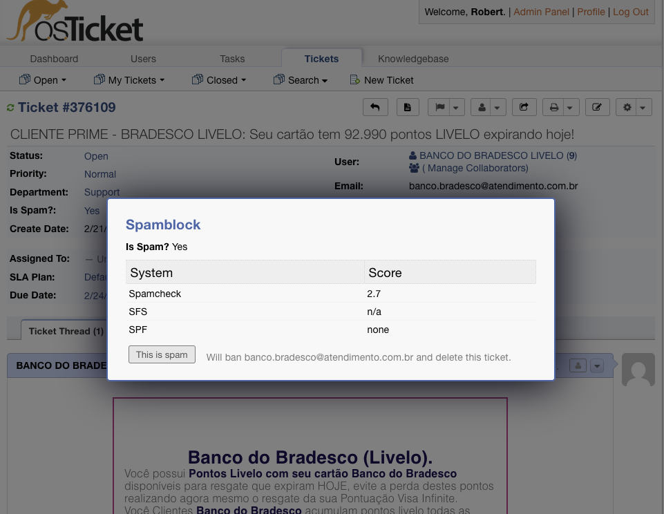

# spamblock (osTicket plugin)
A plugin for osTicket that spam-checks inbound email tickets and blocks them over a configurable score threshold.

## Works with

version 1.18

## Installation (GitHub Releases)
1. Download `spamblock.phar` from this repo’s **Releases** page.
2. Copy it into your osTicket installation’s `include/plugins/` directory.
   - Example path: `<osticket-root>/include/plugins/spamblock.phar`
3. In osTicket: Admin Panel → Manage → Plugins → Install/Enable **Spamblock**.

Notes:
- The `.phar` file must be readable by the web server user.
- PHP must have PHAR support enabled (most distributions do).

## What it does
- Intercepts ticket creation for tickets created from email (via the `ticket.create.before` signal).
- Calls Postmark’s Spamcheck API (`https://spamcheck.postmarkapp.com/filter`).
- Calls StopForumSpam (`https://api.stopforumspam.org/api`) with the sender email address and best-effort originating IP.
- Optionally performs an SPF check using the sender domain + best-effort originating IP.
- Optionally performs an AI spam review using Gemini with the full raw email as input.
- Logs every checked email with:
  - message-id (`mid`)
  - sender (`from`)
  - subject
  - Postmark spam score
  - StopForumSpam confidence
  - SPF result (`pass`, `fail`, `none`, `invalid`, `unsupported`)
  - Gemini classification (`spam` / `legitimate`) when Gemini returns a result
  - Gemini reasoning when Gemini returns a result
  - whether it would be blocked
- Blocks tickets when either:
  - `postmark_score >= min_block_score`, or
  - `sfs_confidence >= sfs_min_confidence`, or
  - SPF result matches your configured SPF actions, or
  - Gemini classifies the message as spam and `Gemini: when spam is detected` is set to `Treat as Spam`

If Postmark, StopForumSpam, or Gemini have network/HTTP/API parsing errors, Spamblock fails open:
- the ticket is **not** treated as spam based on that provider
- the ticket flow continues
- the provider error is kept in Spamblock’s debug logging for diagnosis

## Configuration
In osTicket: Admin Panel → Manage → Plugins → Spamblock
- `Test Mode`
- `Blocked email log level`
- `Postmark: minimum score to block`
- `StopForumSpam: minimum confidence (%)`
- `SPF: check fails` (Do Nothing / Treat as Spam)
- `SPF: record missing` (Do Nothing / Treat as Spam)
- `SPF: record invalid` (Do Nothing / Treat as Spam)
- `SPF: unsupported mechanism` (Do Nothing / Treat as Spam)
- `Enable AI Spam Check`
- `Gemini: when spam is detected` (Do Nothing / Treat as Spam)
- `Gemini: API key`
- `Company Description for AI`
- `Spam Guidelines for AI`
- `Legitimate Guidelines for AI`

### Gemini / AI spam check
Gemini is optional and is controlled by the `Enable AI Spam Check` setting.

When enabled, Spamblock sends the full raw email to Gemini and asks it to return structured JSON:
- `spam` (`true` / `false`)
- `reasoning` (one sentence)

The Gemini request currently uses:
- model: `gemini-3-flash-preview`
- thinking level: `high`
- temperature: `0`

The prompt is built from three configurable fields:
- `Company Description for AI`
- `Spam Guidelines for AI`
- `Legitimate Guidelines for AI`

These fields ship with defaults and can be overridden for your help desk.

Important Gemini behavior:
- If `Enable AI Spam Check` is off, Gemini is not called.
- If `Enable AI Spam Check` is on **but** `Gemini: API key` is empty, Gemini is still skipped.
- If Gemini returns a network/HTTP/response-format error, the ticket is **not** classified as spam from Gemini.

### SPF optimization
If all SPF actions are set to **Do Nothing**, SPF checks are skipped entirely.

### Gemini action
`Gemini: when spam is detected` controls what happens when Gemini successfully classifies a message as spam:
- `Do Nothing`: Gemini still evaluates and logs the result, but does not block the ticket.
- `Treat as Spam`: Gemini can cause the ticket to be blocked.

### Provider error handling
Postmark, StopForumSpam, and Gemini are all fail-open:
- network errors do not block the ticket
- non-2xx HTTP responses do not block the ticket
- malformed/unusable API responses do not block the ticket

### Test Mode
When **Test Mode** is enabled, Spamblock will **not block** any inbound emails.

Instead, it will emit a **warning** log entry for anything that *would have been blocked*:
- Log title: `Spamblock - Would have blocked Email`
- Contains: `email`, `system` (`Spamcheck`, `SFS`, `SPF`, or `Gemini`), and the provider result
- Gemini warning entries also include the returned reasoning text

This lets you tune thresholds safely by observing what would be blocked before turning blocking on.

## Ticket UI
On the staff ticket view, Spamblock adds:
- A label in the ticket header: `Is Spam?` (Yes/No)

- A popup (via the ticket “More” menu and the label) that shows per-provider results (Spamcheck + SFS + SPF + Gemini)
- When Gemini returns a result, the popup also shows the Gemini reasoning text

In **Test Mode**, you’ll see real `Is Spam?` Yes/No values based on your configured thresholds.
In normal mode, spam would typically be blocked before ticket creation, so you’ll usually see `No`.

### "This is spam" button
In the Spamblock popup there is a **This is spam** button (requires permissions to ban email + delete tickets). When clicked it:
1. Adds the ticket’s email address to osTicket’s System Ban List
2. Deletes the ticket

## How blocking works (implementation detail)
Spamblock sets two internal fields on inbound email ticket creation:
- `spamblock_score`
- `spamblock_should_block` (`0` or `1`)

On startup, Spamblock creates (or updates) an osTicket Ticket Filter named `Spamblock: block by score` that rejects tickets when `spamblock_should_block == 1`.

## Provider architecture (implementation detail)
Spamblock is structured to support multiple spam-check providers internally.
- Provider interface + Postmark + SFS live in `plugin/spamblock/lib/spamcheck.php`.
- Gemini provider lives in `plugin/spamblock/lib/geminicheck.php`.
- SPF provider lives in `plugin/spamblock/lib/spfcheck.php`.
- Providers are composed into a collection. In the future, additional providers can be added to the provider list without changing any UI.

## What’s in this repo
- `plugin/spamblock/`: plugin source code
- `docker/osticket/`: a Dockerfile that builds an osTicket container for local testing
- `docker-compose.yml`: osTicket + MariaDB stack for local development
- `.prompts/`: prompt history for changes made to this repo

## Quickstart (local dev)
1. Start the stack:
   - `docker compose up --build`
2. Open the installer:
   - `http://localhost:8080/setup/`
3. Use these DB values in the installer:
   - MySQL Hostname: `db`
   - MySQL Database: `osticket`
   - MySQL Username: `osticket`
   - MySQL Password: `osticket`

## Plugin development workflow (high level)
- Develop the plugin in `plugin/spamblock/`.
- The `./plugin` folder is bind-mounted into the osTicket container at `include/plugins/`.
- Enable/configure the plugin in osTicket via Admin Panel → Manage → Plugins.

## Building the PHAR locally
This repo includes a small build script that packages `plugin/spamblock/` into `dist/spamblock.phar`.

- `php -d phar.readonly=0 scripts/build-phar.php --out dist/spamblock.phar`

## Releasing
Releases are published automatically by GitHub Actions when a version tag like `v0.2.1` is pushed.

This repo includes a helper script to bump the version and create the tag:
- `./scripts/release.sh 0.2.1`

Then push the commit + tag:
- `git push origin main --follow-tags`

## Notes
- Local osTicket config is stored in `.osticket/` and is intentionally ignored by git.
- This is a development setup; hardening (locking down `setup/`, file permissions, production mail, etc.) comes later.

## License
This project is licensed under the **Say Thanks License**.
If you find this useful, [click here to say thanks!](https://saythanks.io/to/rmaclean)